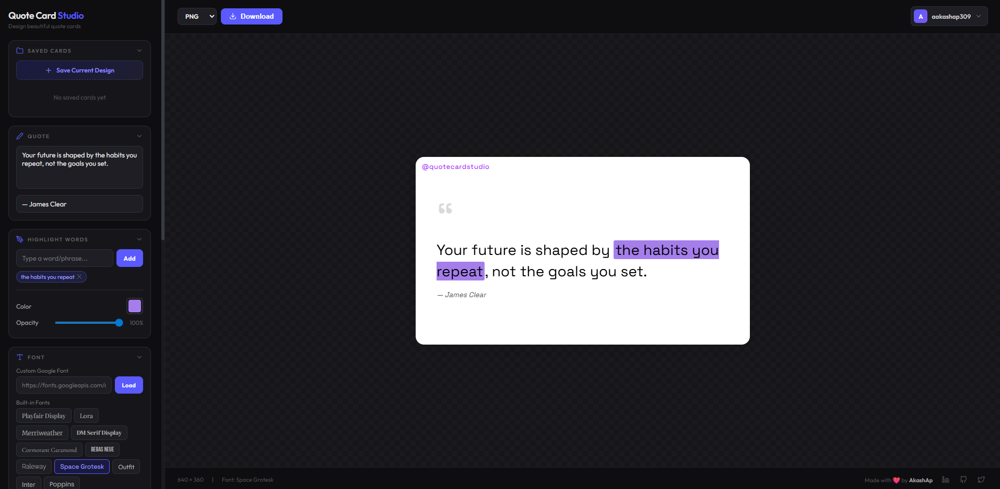

<div align="center">
  

  <h1>Quote Card Studio</h1>
  
  <p>
    <strong>A powerful, modern web application for designing beautiful, shareable quote cards instantly.</strong>
  </p>

  <p>
    <a href="quote-studio-ap.vercel.app"><strong>🔴 View Live Demo</strong></a>
  </p>
</div>

## ✨ Features

- **Rich Text Customization**: Choose from premium Google Fonts, adjust sizes, line heights, colors, and alignments.
- **Word Highlights**: Make specific words pop out with custom background highlight colors and opacities.
- **Dynamic Backgrounds**: Support for solid colors, stunning gradient presets, custom background images with overlays, and playful emoji patterns.
- **Card Styling**: Granular control over padding, corner radiuses, drop shadows, and border styles.
- **Custom Watermarks**: Protect your work or brand your quotes with customizable watermarks.
- **Cloud Saves via Supabase**: Seamless authentication lets you save your designs securely to the cloud and access them across devices.
- **High-Quality Export**: Instantly export your masterpiece as PNG, JPG, SVG, or WebP.

## 🛠️ Tech Stack

- **Frontend**: React 18, Vite
- **Styling**: Vanilla CSS with modern layout techniques (CSS Variables, Flexbox, Grid)
- **Backend & Auth**: Supabase (PostgreSQL, Row Level Security, Auth)
- **Image Generation**: `html-to-image`

## 🚀 Getting Started

### Prerequisites

You will need [Node.js](https://nodejs.org/) installed on your machine and a [Supabase](https://supabase.com/) project.

### 1. Clone & Install

```bash
git clone https://github.com/AakashAp01/quote-card-studio.git
cd quote-card-studio
npm install
```

### 2. Environment Variables

Create a `.env` file in the root directory (you can copy `.env.example`):

```env
VITE_SUPABASE_URL=your_supabase_project_url
VITE_SUPABASE_ANON_KEY=your_supabase_anon_key
```

### 3. Supabase Setup

Open your Supabase SQL Editor and run the following commands to create the `saved_cards` table and configure the security policies:

```sql
-- Create the saved_cards table
create table saved_cards (
  id uuid default gen_random_uuid() primary key,
  user_id uuid references auth.users(id) not null,
  name text not null,
  state jsonb not null,
  created_at timestamp with time zone default timezone('utc'::text, now()) not null,
  updated_at timestamp with time zone default timezone('utc'::text, now()) not null
);

-- Enable Row Level Security (RLS)
alter table saved_cards enable row level security;

-- Create policies so users can only access their own cards
create policy "Users can view their own cards"
  on saved_cards for select
  using (auth.uid() = user_id);

create policy "Users can insert their own cards"
  on saved_cards for insert
  with check (auth.uid() = user_id);

create policy "Users can update their own cards"
  on saved_cards for update
  using (auth.uid() = user_id)
  with check (auth.uid() = user_id);

create policy "Users can delete their own cards"
  on saved_cards for delete
  using (auth.uid() = user_id);
```

### 4. Run the Development Server

```bash
npm run dev
```

Your app will be running at `http://localhost:5173`.

## 🤝 Crafted By

Made with ❤️ by **AkashAp**
- [LinkedIn](https://www.linkedin.com/in/aakashap/)
- [GitHub](https://github.com/AakashAp01)
- [X (Twitter)](https://x.com/_akash_ap_)
